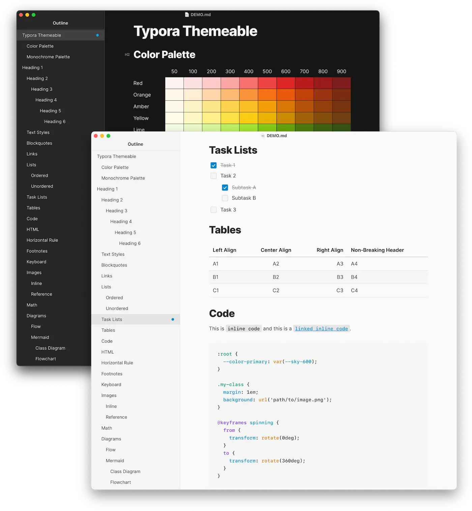

# typora-themeable

A clean, customizable, typography-focused theme system for the markdown editor, [Typora](https://typora.io).

<figure align="center">
  <a href="https://jhildenbiddle.github.io/typora-themeable/">
    <picture>
      <source srcset="docs/assets/img/screenshot-dark.webp" width="700" media="(prefers-color-scheme:dark)">
      
    </picture>
  </a>
  <figcaption>Light and dark theme examples</figcaption>
</figure>

## Features

- Fast and flexible customization using CSS custom properties
- Light mode, dark mode, and auto-switching theme variants
- Based on the [Inter](https://rsms.me/inter/) typeface family by [Rasmus Andersson](https://rsms.me) ([@rsms](https://twitter.com/rsms))
- Includes color presets from [Tailwind CSS](https://tailwindcss.com/docs/customizing-colors)
- Compatible with all Typora platforms (macOS, Windows, Linux)

## Installation & Customization

See the [documentation site](https://jhildenbiddle.github.io/typora-themeable/) for details.

## Contact & Support

- Create a [GitHub issue](https://github.com/jhildenbiddle/typora-themeable/issues) for bug reports, feature requests, or questions
- Follow [@jhildenbiddle](https://twitter.com/jhildenbiddle) for announcements
- Add a ⭐️ [star on GitHub](https://github.com/jhildenbiddle/typora-themeable) or 🐦 [tweet](https://twitter.com/intent/tweet?url=https%3A%2F%2Fgithub.com%2Fjhildenbiddle%2Ftypora-themeable&hashtags=typora,markdown,css,developers) to support the project!

## License

This project is licensed under the MIT License. See the [LICENSE](https://github.com/jhildenbiddle/typora-themeable/blob/master/LICENSE) for details.

Copyright (c) John Hildenbiddle ([@jhildenbiddle](https://twitter.com/jhildenbiddle))
