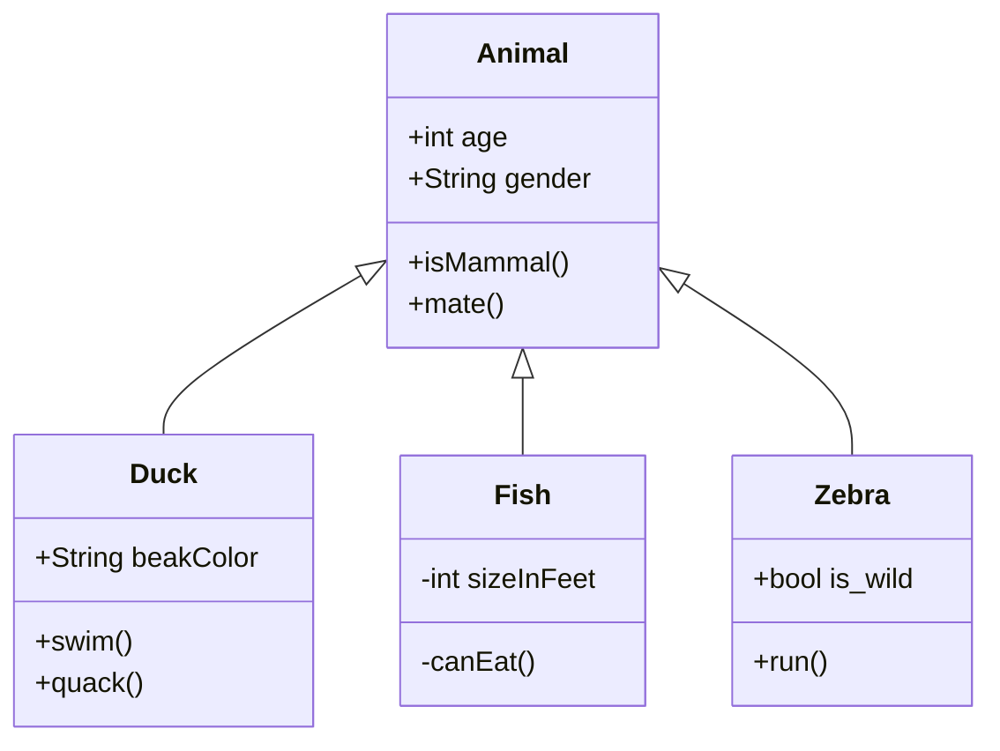
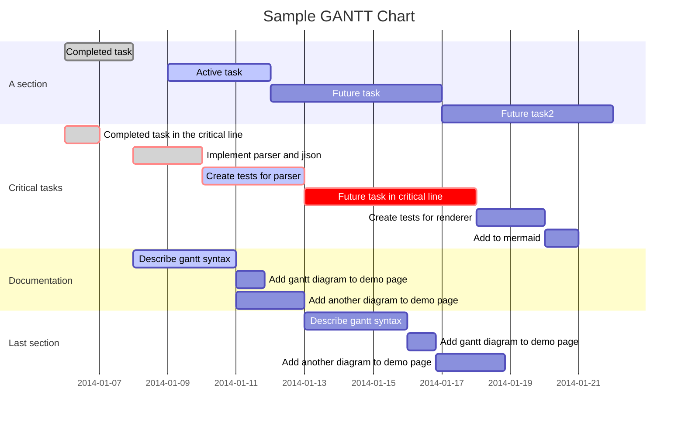
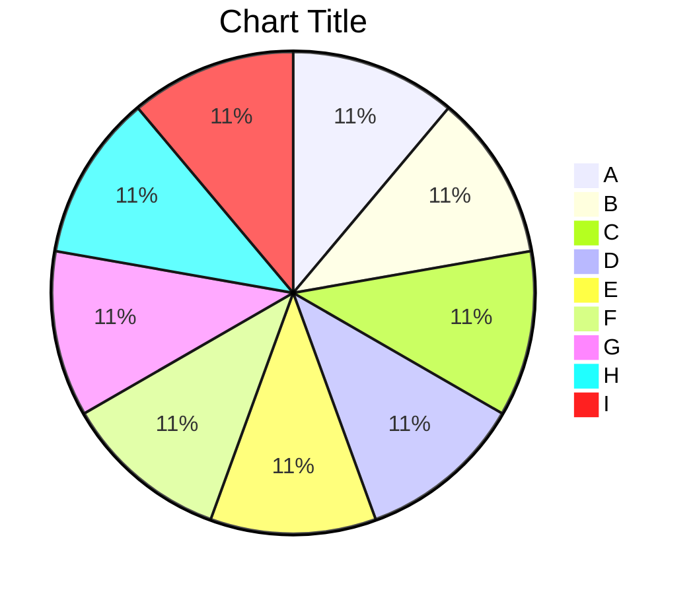
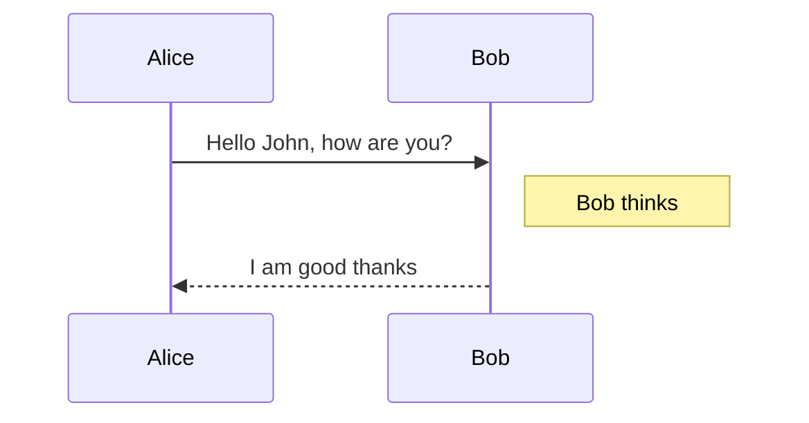

# Typora Themeable

## Color Palette

<div style="display: grid; grid-template-columns: repeat(11, 1fr); line-height: 2.25; gap: 1px;">
  <div></div>
  <div style="text-align: center;">50</div>
  <div style="text-align: center;">100</div>
  <div style="text-align: center;">200</div>
  <div style="text-align: center;">300</div>
  <div style="text-align: center;">400</div>
  <div style="text-align: center;">500</div>
  <div style="text-align: center;">600</div>
  <div style="text-align: center;">700</div>
  <div style="text-align: center;">800</div>
  <div style="text-align: center;">900</div>
  <div style="min-width: 10ch;">Red</div>
  <div style="background: var(--red-50);"></div>
  <div style="background: var(--red-100);"></div>
  <div style="background: var(--red-200);"></div>
  <div style="background: var(--red-300);"></div>
  <div style="background: var(--red-400);"></div>
  <div style="background: var(--red-500);"></div>
  <div style="background: var(--red-600);"></div>
  <div style="background: var(--red-700);"></div>
  <div style="background: var(--red-800);"></div>
  <div style="background: var(--red-900);"></div>
  <div>Orange</div>
  <div style="background: var(--orange-50);"></div>
  <div style="background: var(--orange-100);"></div>
  <div style="background: var(--orange-200);"></div>
  <div style="background: var(--orange-300);"></div>
  <div style="background: var(--orange-400);"></div>
  <div style="background: var(--orange-500);"></div>
  <div style="background: var(--orange-600);"></div>
  <div style="background: var(--orange-700);"></div>
  <div style="background: var(--orange-800);"></div>
  <div style="background: var(--orange-900);"></div>
  <div>Amber</div>
  <div style="background: var(--amber-50);"></div>
  <div style="background: var(--amber-100);"></div>
  <div style="background: var(--amber-200);"></div>
  <div style="background: var(--amber-300);"></div>
  <div style="background: var(--amber-400);"></div>
  <div style="background: var(--amber-500);"></div>
  <div style="background: var(--amber-600);"></div>
  <div style="background: var(--amber-700);"></div>
  <div style="background: var(--amber-800);"></div>
  <div style="background: var(--amber-900);"></div>
  <div>Yellow</div>
  <div style="background: var(--yellow-50);"></div>
  <div style="background: var(--yellow-100);"></div>
  <div style="background: var(--yellow-200);"></div>
  <div style="background: var(--yellow-300);"></div>
  <div style="background: var(--yellow-400);"></div>
  <div style="background: var(--yellow-500);"></div>
  <div style="background: var(--yellow-600);"></div>
  <div style="background: var(--yellow-700);"></div>
  <div style="background: var(--yellow-800);"></div>
  <div style="background: var(--yellow-900);"></div>
  <div>Lime</div>
  <div style="background: var(--lime-50);"></div>
  <div style="background: var(--lime-100);"></div>
  <div style="background: var(--lime-200);"></div>
  <div style="background: var(--lime-300);"></div>
  <div style="background: var(--lime-400);"></div>
  <div style="background: var(--lime-500);"></div>
  <div style="background: var(--lime-600);"></div>
  <div style="background: var(--lime-700);"></div>
  <div style="background: var(--lime-800);"></div>
  <div style="background: var(--lime-900);"></div>
  <div>Green</div>
  <div style="background: var(--green-50);"></div>
  <div style="background: var(--green-100);"></div>
  <div style="background: var(--green-200);"></div>
  <div style="background: var(--green-300);"></div>
  <div style="background: var(--green-400);"></div>
  <div style="background: var(--green-500);"></div>
  <div style="background: var(--green-600);"></div>
  <div style="background: var(--green-700);"></div>
  <div style="background: var(--green-800);"></div>
  <div style="background: var(--green-900);"></div>
  <div>Emerald</div>
  <div style="background: var(--emerald-50);"></div>
  <div style="background: var(--emerald-100);"></div>
  <div style="background: var(--emerald-200);"></div>
  <div style="background: var(--emerald-300);"></div>
  <div style="background: var(--emerald-400);"></div>
  <div style="background: var(--emerald-500);"></div>
  <div style="background: var(--emerald-600);"></div>
  <div style="background: var(--emerald-700);"></div>
  <div style="background: var(--emerald-800);"></div>
  <div style="background: var(--emerald-900);"></div>
  <div>Teal</div>
  <div style="background: var(--teal-50);"></div>
  <div style="background: var(--teal-100);"></div>
  <div style="background: var(--teal-200);"></div>
  <div style="background: var(--teal-300);"></div>
  <div style="background: var(--teal-400);"></div>
  <div style="background: var(--teal-500);"></div>
  <div style="background: var(--teal-600);"></div>
  <div style="background: var(--teal-700);"></div>
  <div style="background: var(--teal-800);"></div>
  <div style="background: var(--teal-900);"></div>
  <div>Cyan</div>
  <div style="background: var(--cyan-50);"></div>
  <div style="background: var(--cyan-100);"></div>
  <div style="background: var(--cyan-200);"></div>
  <div style="background: var(--cyan-300);"></div>
  <div style="background: var(--cyan-400);"></div>
  <div style="background: var(--cyan-500);"></div>
  <div style="background: var(--cyan-600);"></div>
  <div style="background: var(--cyan-700);"></div>
  <div style="background: var(--cyan-800);"></div>
  <div style="background: var(--cyan-900);"></div>
  <div>Sky</div>
  <div style="background: var(--sky-50);"></div>
  <div style="background: var(--sky-100);"></div>
  <div style="background: var(--sky-200);"></div>
  <div style="background: var(--sky-300);"></div>
  <div style="background: var(--sky-400);"></div>
  <div style="background: var(--sky-500);"></div>
  <div style="background: var(--sky-600);"></div>
  <div style="background: var(--sky-700);"></div>
  <div style="background: var(--sky-800);"></div>
  <div style="background: var(--sky-900);"></div>
  <div>Blue</div>
  <div style="background: var(--blue-50);"></div>
  <div style="background: var(--blue-100);"></div>
  <div style="background: var(--blue-200);"></div>
  <div style="background: var(--blue-300);"></div>
  <div style="background: var(--blue-400);"></div>
  <div style="background: var(--blue-500);"></div>
  <div style="background: var(--blue-600);"></div>
  <div style="background: var(--blue-700);"></div>
  <div style="background: var(--blue-800);"></div>
  <div style="background: var(--blue-900);"></div>
  <div>Indigo</div>
  <div style="background: var(--indigo-50);"></div>
  <div style="background: var(--indigo-100);"></div>
  <div style="background: var(--indigo-200);"></div>
  <div style="background: var(--indigo-300);"></div>
  <div style="background: var(--indigo-400);"></div>
  <div style="background: var(--indigo-500);"></div>
  <div style="background: var(--indigo-600);"></div>
  <div style="background: var(--indigo-700);"></div>
  <div style="background: var(--indigo-800);"></div>
  <div style="background: var(--indigo-900);"></div>
  <div>Violet</div>
  <div style="background: var(--violet-50);"></div>
  <div style="background: var(--violet-100);"></div>
  <div style="background: var(--violet-200);"></div>
  <div style="background: var(--violet-300);"></div>
  <div style="background: var(--violet-400);"></div>
  <div style="background: var(--violet-500);"></div>
  <div style="background: var(--violet-600);"></div>
  <div style="background: var(--violet-700);"></div>
  <div style="background: var(--violet-800);"></div>
  <div style="background: var(--violet-900);"></div>
  <div>Purple</div>
  <div style="background: var(--purple-50);"></div>
  <div style="background: var(--purple-100);"></div>
  <div style="background: var(--purple-200);"></div>
  <div style="background: var(--purple-300);"></div>
  <div style="background: var(--purple-400);"></div>
  <div style="background: var(--purple-500);"></div>
  <div style="background: var(--purple-600);"></div>
  <div style="background: var(--purple-700);"></div>
  <div style="background: var(--purple-800);"></div>
  <div style="background: var(--purple-900);"></div>
  <div>Fuchsia</div>
  <div style="background: var(--fuchsia-50);"></div>
  <div style="background: var(--fuchsia-100);"></div>
  <div style="background: var(--fuchsia-200);"></div>
  <div style="background: var(--fuchsia-300);"></div>
  <div style="background: var(--fuchsia-400);"></div>
  <div style="background: var(--fuchsia-500);"></div>
  <div style="background: var(--fuchsia-600);"></div>
  <div style="background: var(--fuchsia-700);"></div>
  <div style="background: var(--fuchsia-800);"></div>
  <div style="background: var(--fuchsia-900);"></div>
  <div>Pink</div>
  <div style="background: var(--pink-50);"></div>
  <div style="background: var(--pink-100);"></div>
  <div style="background: var(--pink-200);"></div>
  <div style="background: var(--pink-300);"></div>
  <div style="background: var(--pink-400);"></div>
  <div style="background: var(--pink-500);"></div>
  <div style="background: var(--pink-600);"></div>
  <div style="background: var(--pink-700);"></div>
  <div style="background: var(--pink-800);"></div>
  <div style="background: var(--pink-900);"></div>
  <div>Rose</div>
  <div style="background: var(--rose-50);"></div>
  <div style="background: var(--rose-100);"></div>
  <div style="background: var(--rose-200);"></div>
  <div style="background: var(--rose-300);"></div>
  <div style="background: var(--rose-400);"></div>
  <div style="background: var(--rose-500);"></div>
  <div style="background: var(--rose-600);"></div>
  <div style="background: var(--rose-700);"></div>
  <div style="background: var(--rose-800);"></div>
  <div style="background: var(--rose-900);"></div>
</div>

## Monochrome Palette

<div style="display: grid; grid-template-columns: repeat(11, 1fr); line-height: 2.25; gap: 1px;">
  <div></div>
  <div style="text-align: center;">50</div>
  <div style="text-align: center;">100</div>
  <div style="text-align: center;">200</div>
  <div style="text-align: center;">300</div>
  <div style="text-align: center;">400</div>
  <div style="text-align: center;">500</div>
  <div style="text-align: center;">600</div>
  <div style="text-align: center;">700</div>
  <div style="text-align: center;">800</div>
  <div style="text-align: center;">900</div>
  <div style="min-width: 10ch;">Slate</div>
  <div style="background: var(--slate-50);"></div>
  <div style="background: var(--slate-100);"></div>
  <div style="background: var(--slate-200);"></div>
  <div style="background: var(--slate-300);"></div>
  <div style="background: var(--slate-400);"></div>
  <div style="background: var(--slate-500);"></div>
  <div style="background: var(--slate-600);"></div>
  <div style="background: var(--slate-700);"></div>
  <div style="background: var(--slate-800);"></div>
  <div style="background: var(--slate-900);"></div>
  <div>Gray</div>
  <div style="background: var(--gray-50);"></div>
  <div style="background: var(--gray-100);"></div>
  <div style="background: var(--gray-200);"></div>
  <div style="background: var(--gray-300);"></div>
  <div style="background: var(--gray-400);"></div>
  <div style="background: var(--gray-500);"></div>
  <div style="background: var(--gray-600);"></div>
  <div style="background: var(--gray-700);"></div>
  <div style="background: var(--gray-800);"></div>
  <div style="background: var(--gray-900);"></div>
  <div>Zinc</div>
  <div style="background: var(--zinc-50);"></div>
  <div style="background: var(--zinc-100);"></div>
  <div style="background: var(--zinc-200);"></div>
  <div style="background: var(--zinc-300);"></div>
  <div style="background: var(--zinc-400);"></div>
  <div style="background: var(--zinc-500);"></div>
  <div style="background: var(--zinc-600);"></div>
  <div style="background: var(--zinc-700);"></div>
  <div style="background: var(--zinc-800);"></div>
  <div style="background: var(--zinc-900);"></div>
  <div>Neutral</div>
  <div style="background: var(--neutral-50);"></div>
  <div style="background: var(--neutral-100);"></div>
  <div style="background: var(--neutral-200);"></div>
  <div style="background: var(--neutral-300);"></div>
  <div style="background: var(--neutral-400);"></div>
  <div style="background: var(--neutral-500);"></div>
  <div style="background: var(--neutral-600);"></div>
  <div style="background: var(--neutral-700);"></div>
  <div style="background: var(--neutral-800);"></div>
  <div style="background: var(--neutral-900);"></div>
  <div>Stone</div>
  <div style="background: var(--stone-50);"></div>
  <div style="background: var(--stone-100);"></div>
  <div style="background: var(--stone-200);"></div>
  <div style="background: var(--stone-300);"></div>
  <div style="background: var(--stone-400);"></div>
  <div style="background: var(--stone-500);"></div>
  <div style="background: var(--stone-600);"></div>
  <div style="background: var(--stone-700);"></div>
  <div style="background: var(--stone-800);"></div>
  <div style="background: var(--stone-900);"></div>
</div>

# Heading 1

Lorem ipsum dolor sit amet, consectetuer adipiscing elit. Aenean commodo ligula eget dolor. Aenean massa. Cum sociis natoque penatibus et magnis dis parturient montes.

## Heading 2

Lorem ipsum dolor sit amet, consectetuer adipiscing elit. Aenean commodo ligula eget dolor. Aenean massa. Cum sociis natoque penatibus et magnis dis parturient montes.

### Heading 3

Lorem ipsum dolor sit amet, consectetuer adipiscing elit. Aenean commodo ligula eget dolor. Aenean massa. Cum sociis natoque penatibus et magnis dis parturient montes.

#### Heading 4

Lorem ipsum dolor sit amet, consectetuer adipiscing elit. Aenean commodo ligula eget dolor. Aenean massa. Cum sociis natoque penatibus et magnis dis parturient montes.

##### Heading 5

Lorem ipsum dolor sit amet, consectetuer adipiscing elit. Aenean commodo ligula eget dolor. Aenean massa. Cum sociis natoque penatibus et magnis dis parturient montes.

###### Heading 6

Lorem ipsum dolor sit amet, consectetuer adipiscing elit. Aenean commodo ligula eget dolor. Aenean massa. Cum sociis natoque penatibus et magnis dis parturient montes.

## Text Styles

Body text

*Italic text*

**Bold text**

~~Strikethrough~~

==Highlight text==

<u>Underline Text</u>

<pre>Preformatted text</pre>

<small>Small Text</small>

This is ^superscript^ text

This is ~subscript~ text

## Blockquotes

> Cras aliquet nulla quis metus tincidunt, sed placerat enim cursus. Etiam turpis nisl, posuere eu condimentum ut, interdum a risus. Sed non luctus mi. Quisque malesuada risus sit amet tortor aliquet, a posuere ex iaculis. Vivamus ultrices enim dui, eleifend porttitor elit aliquet sed.
>
> \- Quote Source

## Links

[Inline link](https://google.com "This is an optional title")

[Reference link][link1]

www.some-domain.com <!-- markdownlint-disable no-bare-urls -->

person@email.com <!-- markdownlint-disable no-bare-urls -->

[link1]: https://google.com "This an optional title"

## Lists

### Ordered

1. Ordered 1
1. Ordered 2
   1. Ordered 2a
   1. Ordered 2b
1. Ordered 3

### Unordered

- Unordered 1
- Unordered 2
  - Unordered 2a
  - Unordered 2b
- Unordered 3

## Task Lists

- [x] Task 1
- [ ] Task 2
  - [x] Subtask A
  - [ ] Subtask B
- [ ] Task 3

## Tables

| Left Align | Center Align | Right Align | Non&#8209;Breaking&nbsp;Header |
| :--------- | :----------: | ----------: | ------------------------------ |
| A1         |      A2      |          A3 | A4                             |
| B1         |      B2      |          B3 | B4                             |
| C1         |      C2      |          C3 | C4                             |

## Code

This is `inline code` and this is a [`linked inline code`](https://google.com).

```css
:root {
  --color-primary: var(--sky-600);
}

.my-class {
  margin: 1em;
  background: url('path/to/image.png');
}

@keyframes spinning {
  from {
    transform: rotate(0deg);
  }
  to {
    transform: rotate(360deg);
  }
}
```

```javascript
// Mergician - https://jhildenbiddle.github.io/mergician/
import mergician from 'mergician';

const obj1 = { a: [1, 1], b: { c: 1, d: 1 } };
const obj2 = { a: [2, 2], b: { c: 2 } };
const obj3 = { e: 3 };

const mergedObj = mergician({
    skipKeys: ['d'],
    appendArrays: true,
    dedupArrays: true,
    filter({ depth, key, srcObj, srcVal, targetObj, targetVal }) {
        if (key === 'e') {
            targetObj['hello'] = 'world';
            return false;
        }
    }
})(obj1, obj2, obj3);

console.log(mergedObj);

// Output: { a: [1, 2], b: { c: 2 }, hello: 'world' }
```

```html
<!doctype html>
<html lang="">
<head>
  <meta charset="utf-8">
  <title>My Site</title>
  <meta name="description" content="My web site">
  <link rel="stylesheet" href="css/style.css">
</head>
<body>
  <div id="app">Loading...</p>
  <script src="js/app.js"></script>
</body>
</html>
```

## HTML

<p>
  This is an HTML block. Click to edit.
</p>
<!-- This is an HTML comment -->

<br>

<abbr title="Abbreviation">abbr</abbr> tag with title

<abbr>abbr</abbr> (Abbreviation) tag without title

<dfn title="Definition">dfn</dfn> tag with title

<dfn>dfn</dfn> (Definition) tag without title

## Horizontal Rule

---

## Footnotes

Lorem ipsum dolor sit amet [^footnote].

[^footnote]: This is a *footnote* with **bold text**.

## Keyboard

<kbd>a</kbd><kbd>b</kbd><kbd>c</kbd><kbd>1</kbd><kbd>2</kbd><kbd>3</kbd>

<kbd>F1</kbd><kbd>F2</kbd><kbd>F3</kbd>

<kbd>&#8984; Command</kbd><kbd>Z</kbd>

<kbd>&uarr;</kbd> Arrow Up

<kbd>&darr;</kbd> Arrow Down

<kbd>&larr;</kbd> Arrow Left

<kbd>&rarr;</kbd> Arrow Right

<kbd>&#8682;</kbd> Caps Lock

<kbd>&#8984;</kbd> Command

<kbd>&#8963;</kbd> Control

<kbd>&#9003;</kbd> Delete

<kbd>&#8998;</kbd> Delete (Forward)

<kbd>&#8600;</kbd> End

<kbd>&#8996;</kbd> Enter

<kbd>&#9099;</kbd> Escape

<kbd>&#8598;</kbd> Home

<kbd>&#8997;</kbd> Option / Alt

<kbd>&#8629;</kbd> Return

<kbd>&#8679;</kbd> Shift

<kbd>&#9251;</kbd> Space

<kbd>&#8677;</kbd> Tab

<kbd>&#8676;</kbd> Tab + Shift

## Images

### Inline


### Reference

![alt text][logo]

[logo]: https://source.unsplash.com/1600x900?animals "Provided by unsplash.com"

## Math

$$
\mathbf{V}_1 \times \mathbf{V}_2 =  \begin{vmatrix}
\mathbf{i} & \mathbf{j} & \mathbf{k} \\
\frac{\partial X}{\partial u} &  \frac{\partial Y}{\partial u} & 0 \\
\frac{\partial X}{\partial v} &  \frac{\partial Y}{\partial v} & 0 \\
\end{vmatrix}
$$

## Diagrams

### Flow

```flow
st=>start: Start
op=>operation: Your Operation
cond=>condition: Yes or No?
e=>end

st->op->cond
cond(yes)->e
cond(no)->op
```

### Mermaid

#### Class Diagram



#### Flowchart


#### GANNT



#### Pie Chart



#### Sequence Diagram



### Sequence

```sequence
Alice->Bob: Hello Bob, how are you?
Note right of Bob: Bob thinks
Bob-->Alice: I am good thanks
```

## Embeds

### Iframe

<iframe height='400' scrolling='no' title='CSS Device Frames - Demo' src='http://codepen.io/jhildenbiddle/embed/zYzmzqX/?theme-id=0&default-tab=result&embed-version=2' frameborder='no' allowtransparency='true'></iframe>

### Audio

<audio src="https://s3-us-west-2.amazonaws.com/s.cdpn.io/123941/Yodel_Sound_Effect.mp3" />

### Video

<video src="http://commondatastorage.googleapis.com/gtv-videos-bucket/sample/BigBuckBunny.mp4" />
